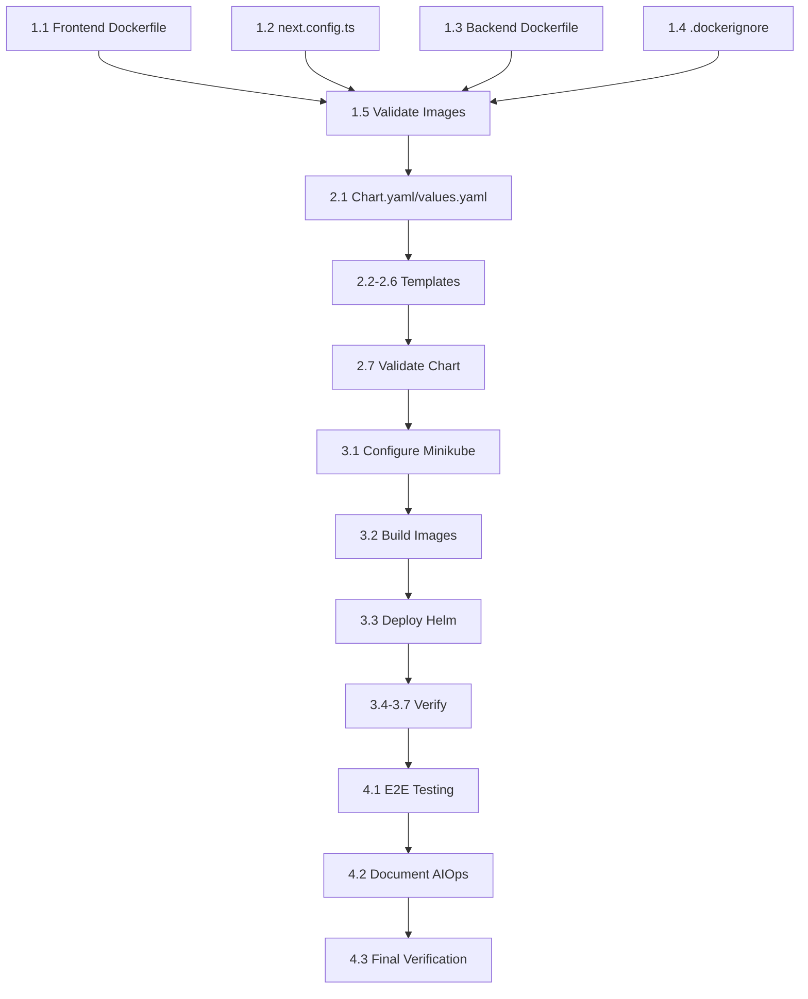

# Phase 4: TeamFlow Kubernetes Deployment - Architecture Plan Prompt

You are acting as the **Cloud-Native DevOps Architect** for TeamFlow. Your goal is to create a detailed **implementation plan** for deploying TeamFlow to a local Minikube Kubernetes cluster.

---

## Context

**Feature Branch**: `001-k8s-minikube-deployment`
**Spec Reference**: `@specs/001-k8s-minikube-deployment/spec.md`
**Phase**: Phase IV - Local Kubernetes Deployment (250 pts)
**Deadline**: January 18, 2026

The feature specification has been completed with:
- 4 User Stories (P1-P4 prioritized)
- 38 Functional Requirements (FR-001 to FR-038)
- 12 Success Criteria (SC-001 to SC-012)
- Edge cases and clarifications documented

This prompt creates the **architecture plan** that bridges spec → implementation.

---

## MANDATORY: Use Skills and MCP Tools

### Required Skill
```
@.claude/skills/cloud-native-blueprints/SKILL.md
```

### Required Research (Before Planning)
```
# Library Documentation
context7 resolve-library-id "helm" → get-library-docs
context7 resolve-library-id "kubernetes" → get-library-docs

# Best Practices Research
tavily search "Kubernetes Helm chart architecture best practices 2025"
tavily search "Docker multi-stage build FastAPI Next.js patterns"
tavily search "Minikube production-like deployment patterns"
```

---

## Specification Summary

### User Stories (Priority Order)

| ID | Story | Priority | Delivers |
|----|-------|----------|----------|
| US-1 | Containerize Application | P1 | Portable Docker images |
| US-2 | Deploy to Minikube | P2 | Working K8s deployment |
| US-3 | Validate E2E Functionality | P3 | Deployment confidence |
| US-4 | Document AIOps Usage | P4 | Hackathon submission |

### Functional Requirements Breakdown

| Category | Count | IDs | Key Requirements |
|----------|-------|-----|------------------|
| Containerization | 10 | FR-001 to FR-010 | Multi-stage builds, non-root, <500MB |
| Helm Charts | 11 | FR-011 to FR-021 | Templates, probes, secrets, rollback |
| Deployment | 11 | FR-022 to FR-032 | Minikube config, pods Running, DB connection |
| AIOps Docs | 6 | FR-033 to FR-038 | Gordon, kubectl-ai, Kagent documentation |

### Success Criteria

| ID | Metric | Threshold |
|----|--------|-----------|
| SC-001 | Docker image size | < 500MB each |
| SC-002 | Helm template render | Zero errors |
| SC-003 | Helm lint | Zero errors |
| SC-004 | Pod startup time | < 5 minutes |
| SC-005 | Frontend load time | < 3 seconds |
| SC-006 | Health check response | < 500ms |
| SC-007 | DB connection | First attempt success |
| SC-011 | Rolling update | Zero downtime |

---

## Architecture Plan Requirements

Create a **plan.md** file at `specs/001-k8s-minikube-deployment/plan.md` with:

### Section 1: Architecture Overview

Provide a high-level architecture diagram (ASCII or Mermaid) showing:
- Minikube cluster components
- TeamFlow namespace resources
- Service communication patterns
- External dependencies (Neon PostgreSQL)

```
Example Structure:

┌─────────────────── MINIKUBE CLUSTER ───────────────────┐
│                                                         │
│  ┌─────────────── Namespace: teamflow ────────────────┐│
│  │                                                     ││
│  │  [Frontend Deployment]  ──►  [Backend Deployment]  ││
│  │         │                          │               ││
│  │  [Frontend Service]          [Backend Service]     ││
│  │                                    │               ││
│  └─────────────────────────────────────────────────────┘│
│                        │                                │
│               [Ingress Controller]                      │
│                        │                                │
└────────────────────────────────────────────────────────┘
                         │
                [External: Neon PostgreSQL]
```

### Section 2: Implementation Phases

Break down implementation into sequential phases with dependencies:

**Phase 1: Containerization (FR-001 to FR-010)**
- Task 1.1: Create Frontend Dockerfile (FR-001 to FR-004)
- Task 1.2: Modify next.config.ts (FR-010)
- Task 1.3: Optimize Backend Dockerfile (FR-005 to FR-007)
- Task 1.4: Create .dockerignore files (FR-009)
- Task 1.5: Validate image sizes (FR-008)

**Phase 2: Helm Chart Development (FR-011 to FR-021)**
- Task 2.1: Initialize Chart.yaml and values.yaml (FR-011)
- Task 2.2: Create namespace template
- Task 2.3: Create deployment templates (FR-012, FR-014, FR-015)
- Task 2.4: Create service templates (FR-013)
- Task 2.5: Create secrets template (FR-018)
- Task 2.6: Create ingress template (FR-016)
- Task 2.7: Validate chart (FR-019, FR-020)

**Phase 3: Minikube Deployment (FR-022 to FR-032)**
- Task 3.1: Configure Minikube cluster (FR-022 to FR-024)
- Task 3.2: Build images in Minikube (FR-025)
- Task 3.3: Deploy Helm chart (FR-026)
- Task 3.4: Verify pod status (FR-027)
- Task 3.5: Test service access (FR-028, FR-029)
- Task 3.6: Validate DB connection (FR-030, FR-032)
- Task 3.7: Test frontend-backend communication (FR-031)

**Phase 4: Validation & Documentation (FR-033 to FR-038, SC-001 to SC-012)**
- Task 4.1: E2E functionality testing (US-3)
- Task 4.2: Document AIOps commands (FR-033 to FR-038)
- Task 4.3: Verify all success criteria

### Section 3: Technical Decisions

Document architectural decisions for:

1. **Base Image Selection**
   - Frontend: `node:22-alpine` (Why: Small size, LTS support)
   - Backend: `python:3.13-slim` (Why: UV compatibility, minimal footprint)

2. **Health Check Strategy**
   - Liveness Probe: HTTP GET /health (restart if fails)
   - Readiness Probe: HTTP GET /ready (remove from service if fails)
   - Initial delay, period, timeout values

3. **Resource Allocation**
   - Frontend: 100m-500m CPU, 128Mi-512Mi memory
   - Backend: 200m-1000m CPU, 256Mi-1Gi memory
   - Rationale for limits

4. **Secret Management**
   - Kubernetes Secrets (not ConfigMaps)
   - Separate secrets.yaml file (not committed)
   - Values passed via `helm install -f`

5. **Service Exposure**
   - ClusterIP services (internal)
   - Ingress for external access
   - Rationale for ingress vs NodePort vs LoadBalancer

6. **Replica Strategy**
   - Frontend: 2 replicas (zero-downtime rolling updates)
   - Backend: 2 replicas (zero-downtime rolling updates)
   - Rolling update strategy configuration

### Section 4: Edge Case Handling

For each edge case from the spec, document mitigation:

| Edge Case | Mitigation Strategy |
|-----------|---------------------|
| Minikube resource exhaustion | Pre-check: verify 4 CPU, 8GB RAM available |
| Neon PostgreSQL unreachable | Exponential backoff (1s-30s), user-friendly error |
| Docker build failure | Clear error messages, dependency caching |
| Pod restart during traffic | Rolling update with readiness probes |
| Helm install failure | `helm template --debug` for validation |
| Missing env variables | Fail-fast with descriptive error |
| Ingress misconfiguration | Test with port-forward first |
| Resource limits exceeded | CPU throttle, memory OOM with restart |

### Section 5: File Structure

Document all files to be created/modified:

```
teamflow-web/
├── frontend/
│   ├── Dockerfile              # CREATE - Multi-stage Next.js build
│   ├── .dockerignore           # CREATE - Exclude dev artifacts
│   └── next.config.ts          # MODIFY - Add output: 'standalone'
├── backend/
│   ├── Dockerfile              # MODIFY - Optimize multi-stage build
│   └── .dockerignore           # CREATE - Exclude dev artifacts
│
helm/
└── teamflow/
    ├── Chart.yaml              # CREATE - Chart metadata
    ├── values.yaml             # CREATE - Default configuration
    └── templates/
        ├── _helpers.tpl        # CREATE - Template helpers
        ├── namespace.yaml      # CREATE - Namespace definition
        ├── frontend-deployment.yaml   # CREATE
        ├── frontend-service.yaml      # CREATE
        ├── backend-deployment.yaml    # CREATE
        ├── backend-service.yaml       # CREATE
        ├── secrets.yaml               # CREATE
        ├── configmap.yaml             # CREATE
        └── ingress.yaml               # CREATE

docs/
└── PHASE4-AIOPS-COMMANDS.md    # CREATE - AIOps documentation
```

### Section 6: Verification Matrix

Map success criteria to verification commands:

| Criteria | Command | Expected Result |
|----------|---------|-----------------|
| SC-001 | `docker images \| grep teamflow` | Size < 500MB |
| SC-002 | `helm template teamflow ./helm/teamflow` | No errors |
| SC-003 | `helm lint ./helm/teamflow` | 0 warnings, 0 errors |
| SC-004 | `kubectl get pods -n teamflow -w` | Running < 5 min |
| SC-005 | `curl -w "%{time_total}" http://localhost:3000` | < 3s |
| SC-006 | `curl -w "%{time_total}" http://localhost:8000/health` | < 500ms |
| SC-007 | Check backend logs | "Database connected" |
| SC-011 | `kubectl rollout restart` during traffic | No 5xx errors |

### Section 7: Risk Assessment

| Risk | Probability | Impact | Mitigation |
|------|-------------|--------|------------|
| Minikube incompatibility | Low | High | Test on Windows/Mac/Linux |
| Image too large | Medium | Medium | Multi-stage, .dockerignore |
| DB connection fails | Medium | High | Exponential backoff, secrets |
| Helm validation fails | Low | Low | Lint before install |
| Deadline pressure | Medium | High | Prioritize P1-P2 user stories |

### Section 8: Implementation Order

Recommended task execution order with dependencies:



---

## Output Requirements

Create **`specs/001-k8s-minikube-deployment/plan.md`** containing:

1. ✅ Architecture Overview with diagram
2. ✅ Implementation Phases with tasks and FR mappings
3. ✅ Technical Decisions with rationale
4. ✅ Edge Case Handling strategies
5. ✅ Complete File Structure
6. ✅ Verification Matrix
7. ✅ Risk Assessment
8. ✅ Implementation Order (dependency graph)

---

## Constraints Reminder

From spec.md, the plan MUST respect:

1. Multi-stage Docker builds (non-negotiable)
2. Non-root container users (security)
3. Helm for deployment (not raw kubectl)
4. Minikube only (not kind, k3d)
5. AIOps documentation (hackathon requirement)
6. External Neon PostgreSQL (no containerized DB)
7. Images built in Minikube (not external registry)
8. No secrets in git

---

## Dependencies Check

Before planning, verify:

- [ ] TeamFlow frontend and backend are working locally
- [ ] Neon PostgreSQL is accessible
- [ ] Docker is installed and running
- [ ] Minikube CLI is installed
- [ ] Helm CLI is installed
- [ ] kubectl CLI is installed
- [ ] cloud-native-blueprints skill is available

---


